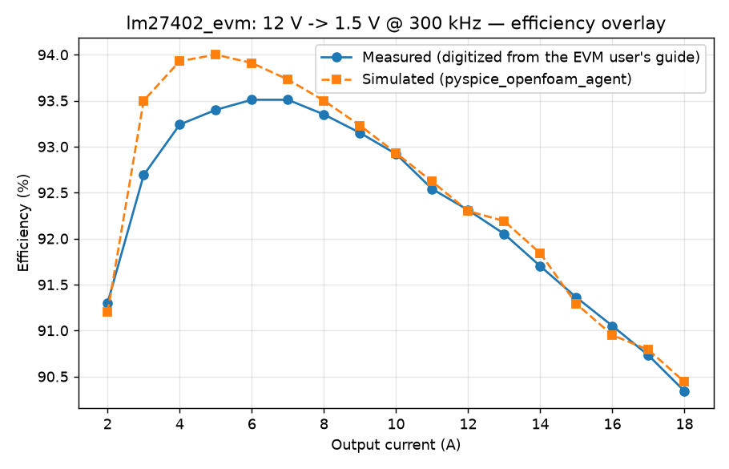
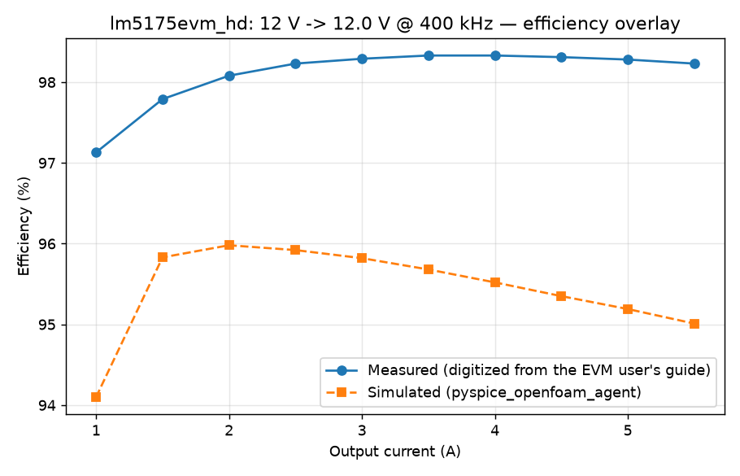

# Validation error report

Generated: 2026-09-23 20:02 UTC. Reproduce every number via `validation/README.md`.

Scope: physics-engine validation with EVM-exact injected parts (component selection is out of scope per the validation plan). Error convention: error = simulated minus measured efficiency, in percentage points (pp). Positive error means the simulator claims BETTER efficiency than the real board delivers -- the optimistic, dangerous direction. Negative error is conservative.

## Summary across topologies

| Topology | EVM | Matched loads | Mean abs error (pp) | Worst point (pp) | Bias direction | Thermal in scope? |
|---|---|---|---|---|---|---|
| boost | not found yet | -- | -- | -- | no (conditions unstated on candidates found) |
| buck | lm27402_evm | 17 | 0.22 | +0.81 @ 3 A | optimistic (over-predicts efficiency) | no (conditions unstated) |
| buck_boost | lm5175evm_hd | 10 | 2.47 | -2.97 @ 5.5 A | conservative (under-predicts efficiency) | no (conditions unstated) |

## buck -- lm27402_evm

| Load (A) | Measured eff (%) | Sim eff (%) | Error (pp) | Digitization unc (pp) | Sim ripple (mV) |
|---|---|---|---|---|---|
| 2 | 91.30 | 91.20 | -0.10 | +/-0.3 | 7.15 |
| 3 | 92.69 | 93.50 | +0.81 | +/-0.3 | 8.56 (exceeds 2x digitization uncertainty) |
| 4 | 93.24 | 93.93 | +0.69 | +/-0.3 | 7.24 (exceeds 2x digitization uncertainty) |
| 5 | 93.40 | 94.00 | +0.60 | +/-0.3 | 7.26 |
| 6 | 93.51 | 93.91 | +0.40 | +/-0.3 | 7.28 |
| 7 | 93.51 | 93.73 | +0.22 | +/-0.3 | 7.3 |
| 8 | 93.35 | 93.50 | +0.15 | +/-0.3 | 7.33 |
| 9 | 93.15 | 93.23 | +0.08 | +/-0.3 | 7.35 |
| 10 | 92.92 | 92.93 | +0.01 | +/-0.3 | 7.37 |
| 11 | 92.54 | 92.62 | +0.08 | +/-0.3 | 7.4 |
| 12 | 92.31 | 92.30 | -0.01 | +/-0.3 | 7.42 |
| 13 | 92.05 | 92.19 | +0.14 | +/-0.3 | 9.77 |
| 14 | 91.70 | 91.84 | +0.14 | +/-0.3 | 9.7 |
| 15 | 91.36 | 91.29 | -0.07 | +/-0.3 | 7.5 |
| 16 | 91.05 | 90.95 | -0.10 | +/-0.3 | 7.52 |
| 17 | 90.73 | 90.79 | +0.06 | +/-0.3 | 9.49 |
| 18 | 90.34 | 90.44 | +0.10 | +/-0.3 | 9.43 |

Mean absolute error: 0.22 pp. Worst point: 3 A at +0.81 pp.

Over-predictions (optimistic, DANGEROUS direction): 13 of 17 points, mean +0.27 pp. Under-predictions (conservative): 4, mean -0.07 pp.

Field sourcing behind these numbers: 21 published / 2 derived / 6 pipeline_estimate / 7 sentinel (sentinels are unused by the simulated physics; estimates are listed as unmatched factors below).
1 simulated point(s) beyond the end of the digitized measured trace are excluded (noted, not silent).
Thermal validation: OUT OF SCOPE -- ambient/airflow are not stated in the source user's guide; no temperature is compared.

Sensitivity check (plateau voltage +/-20%):

| Load (A) | Plateau scale | Sim eff (%) | Error vs measured (pp) |
|---|---|---|---|
| 3 | 0.8 | 93.63 | +0.94 |
| 3 | 1.0 | 93.50 | +0.81 |
| 3 | 1.2 | 93.29 | +0.60 |
| 5 | 0.8 | 94.12 | +0.72 |
| 5 | 1.0 | 94.00 | +0.60 |
| 5 | 1.2 | 93.82 | +0.42 |

Checked-hypothesis result: a +/-20% plateau perturbation moves the 3 A error by only ~+/-0.15 pp and cannot close the +0.8 pp light-load gap even in the loss-increasing direction. The plateau ESTIMATE is therefore NOT the dominant driver of the light-load bias; the omitted loss terms (Qrr, Coss of the HS part, controller/gate quiescent consumption the behavioral rig does not model) remain the consistent explanation.

Known unmatched factors: behavioral 5 V gate drive (no driver IC losses or layout resistances), no input-rail wiring loss, output-cap ESR derived from dissipation factor at 120 Hz (ESR at the switching frequency is unpublished), estimated MOSFET plateau voltages (Vishay publishes them only as curves), and omitted reverse-recovery / Coss switching terms where the datasheet value was not surfaced.

Overlay: 

## buck_boost -- lm5175evm_hd

| Load (A) | Measured eff (%) | Sim eff (%) | Error (pp) | Digitization unc (pp) | Sim ripple (mV) |
|---|---|---|---|---|---|
| 1 | 97.13 | 94.31 | -2.82 | +/-0.3 | 26.48 (exceeds 2x digitization uncertainty) |
| 1.5 | 97.79 | 95.98 | -1.81 | +/-0.3 | 36.2 (exceeds 2x digitization uncertainty) |
| 2 | 98.08 | 96.12 | -1.96 | +/-0.3 | 48.43 (exceeds 2x digitization uncertainty) |
| 2.5 | 98.23 | 96.08 | -2.15 | +/-0.3 | 60.68 (exceeds 2x digitization uncertainty) |
| 3 | 98.29 | 95.99 | -2.30 | +/-0.3 | 73.03 (exceeds 2x digitization uncertainty) |
| 3.5 | 98.33 | 95.86 | -2.47 | +/-0.3 | 85.47 (exceeds 2x digitization uncertainty) |
| 4 | 98.33 | 95.72 | -2.61 | +/-0.3 | 98.02 (exceeds 2x digitization uncertainty) |
| 4.5 | 98.31 | 95.57 | -2.74 | +/-0.3 | 110.6 (exceeds 2x digitization uncertainty) |
| 5 | 98.28 | 95.42 | -2.86 | +/-0.3 | 123.2 (exceeds 2x digitization uncertainty) |
| 5.5 | 98.23 | 95.26 | -2.97 | +/-0.3 | 135.89 (exceeds 2x digitization uncertainty) |

Mean absolute error: 2.47 pp. Worst point: 5.5 A at -2.97 pp.

Over-predictions (optimistic, DANGEROUS direction): 0 of 10 points, mean none. Under-predictions (conservative): 10, mean -2.47 pp.

Field sourcing behind these numbers: 19 published / 2 derived / 7 pipeline_estimate / 6 sentinel (sentinels are unused by the simulated physics; estimates are listed as unmatched factors below).

Superseded result (kept for transparency): The first published buck-boost number (MAE 2.66 pp, worst -3.22 pp @ 6 A) used a SINGLE MOSFET part (BSZ042N06NS, 4.2 mOhm) on all four switches, which over-modeled conduction on the QH2/QL2 leg the EVM implements with BSZ0902NS (2.6 mOhm) - a uniformly conservative bias. That result is superseded by the per-switch injection above; both numbers are kept for transparency.

Open questions (UNRESOLVED - future work):
- UNEXPLAINED RESIDUAL: the per-switch-part fix (BSZ042N06NS on leg 1, BSZ0902NS on leg 2) reduced MAE only marginally (2.66 -> 2.47 pp), not to the ~1 pp predicted from the leg-2 conduction analysis. The real board's 12 V transition point is unusually efficient (~98.3 pct) and the modeled gate/crossover terms plus conservative mask assumptions still overshoot loss there for reasons not yet isolated. Unconfirmed candidate explanations, NOT verified: the behavioral 5 V gate-drive model (no driver IC behavior), omitted Qrr on the LS parts, and crossover-loss model assumptions (TI-Lakkas first-order with clamps) not suited to this switching regime. Treated as a known limitation and open question for future work - the 2.47 pp number is NOT understood or bounded.

Topology-match caveat: Per-switch injection (post engine upgrade): leg 1 (QH1/QL1) carries BSZ042N06NS and leg 2 (QH2/QL2) carries BSZ0902NS, exactly as the EVM BOM. BSZ0902NS Qgd and Vplateau are schema-required estimates (unused by the loss model for the sync role); its Coss/Qrr are unpublished and omitted. This supersedes the earlier single-part-injection result (MAE 2.66 pp), which modeled 4.2 mOhm on all four switches and under-predicted efficiency by construction on the 2.6 mOhm leg.

Thermal validation: OUT OF SCOPE -- ambient/airflow are not stated in the source user's guide; no temperature is compared.

Known unmatched factors: behavioral 5 V gate drive (no driver IC losses or layout resistances), no input-rail wiring loss, output-cap ESR derived from dissipation factor at 120 Hz (ESR at the switching frequency is unpublished), estimated MOSFET plateau voltages (Vishay publishes them only as curves), and omitted reverse-recovery / Coss switching terms where the datasheet value was not surfaced.

Overlay: 

## Rejected EVM candidates

| Topology | Board / source | Reason |
|---|---|---|
| boost | TI SNVA385 (fetched) | Wrong document: it is the LM3445 LED-driver EVM guide, not the LM5122 boost EVM (search-result literature number was wrong). |
| boost | TI SNVA729A (LM5122EVM-1PH, fetched) | Current rev uses the LMG5200 GaN power stage (integrated half-bridge), not discrete MOSFETs -- the rig's injected MOSFET schema (Rds_on/Qg/Qgd/plateau per discrete part) has no defensible mapping. |
| boost | TI LM5122EVM-2PH (SNVA815) | Dual-phase -- the pipeline validates single-phase only. |
| buck_boost | TI SLUUBC4 / SLUUBC6 (LM5175EVM user's guides) | URLs 404 at TI's literature server; SNVU439 (LM5175EVM-HD) fetched instead as the selected candidate. |
| buck_boost | TI SNVU439 (LM5175EVM-HD) -- **SELECTED AND COMPLETED** (validated with per-leg injection: MAE 2.47 pp, uniformly conservative; supersedes the single-part-injection MAE 2.66 pp) | 4-switch non-inverting (exact topology match), 12 V / 6 A @ 400 kHz, full BOM (QH1/QL1 = BSZ042N06NS, QH2/QL2 = BSZ0902NS, L1 = Wurth 7443551370 3.7 uH/4.9 mOhm, 6x 10 uF 50 V output ceramics), "Efficiency vs. Output Current" figure present and vector-digitizable. RESOLVED: verified fields obtained from the Farnell-hosted datasheet table (Rds 4.2 mOhm max, Qg 27/32 nC, Ciss 2000/2500 pF, Vplateau 4.4 V typ) and distributor table data for BSZ0902NS (30 V / 2.6 mOhm max @ 10 V / Qg 26 nC / Ciss 1700 pF / Id 106 A); Qgd/Coss/Crss/Qrr remain unpublished and are handled as documented estimates/omissions. Per-switch injection now matches the BOM: BSZ042N06NS on QH1/QL1, BSZ0902NS on QH2/QL2 -- validation point VIN = 12 V (transition, all four conduct equally). |
| buck_boost | ADI LTC3780 DC1163 | Quick-start guide (4 pages) lacks stated thermal conditions and a digitizable measured-curve source in the fetched form; deferred as the backup candidate. |
| boost | ADI LTC3788-1 eval board | Dual-phase (2-phase) synchronous boost controller -- the pipeline validates single-phase only; same reason as LM5122EVM-2PH. |
| boost | (search round 2 conclusion) | After TI (LM5122 family, TPS40210-class non-sync), ADI (LTC3788-1 dual-phase, LTC3787), and onsemi searches, no single-phase DISCRETE-FET synchronous boost EVM with full schematic + BOM + published efficiency curve + stated ambient/airflow has been found. Boost validation is reported as NOT YET FOUND rather than lowering the completeness bar. Non-synchronous boost EVMs (single FET + rectifier diode, e.g. TPS40210 boards) exist but would not validate the pipeline's synchronous 2-FET boost model without an unquantified topology substitution. |

## Limitations

- Component selection is NOT validated here (parts are injected, not selected -- the validation plan scopes selection out).
- One EVM per topology, one input voltage and one load sweep per EVM: this validates the physics engine at the measured operating points, not across the full input/frequency design space.
- Thermal validation is out of scope for every EVM processed so far (ambient/airflow unstated in their sources); no temperature comparison is claimed anywhere in this report.
- Digitization uncertainty (+/-0.3 pp) is a floor under every error claim; points exceeding 2x that are flagged in the tables.
- Buck-boost topology match: see the per-EVM section for any caveat where the EVM's switch configuration differs from the pipeline's 4-switch non-inverting model.
- The pipeline is deterministic at fixed load; single runs per point (no run-to-run variance term is needed).
- Buck-boost residual is an OPEN QUESTION: the per-switch fix recovered only 2.66 -> 2.47 pp of the ~2.7 pp under-prediction at the 12 V transition point; the remaining gap is unexplained (candidate causes listed in the buck-boost section) and the 2.47 pp number is not understood or bounded.

